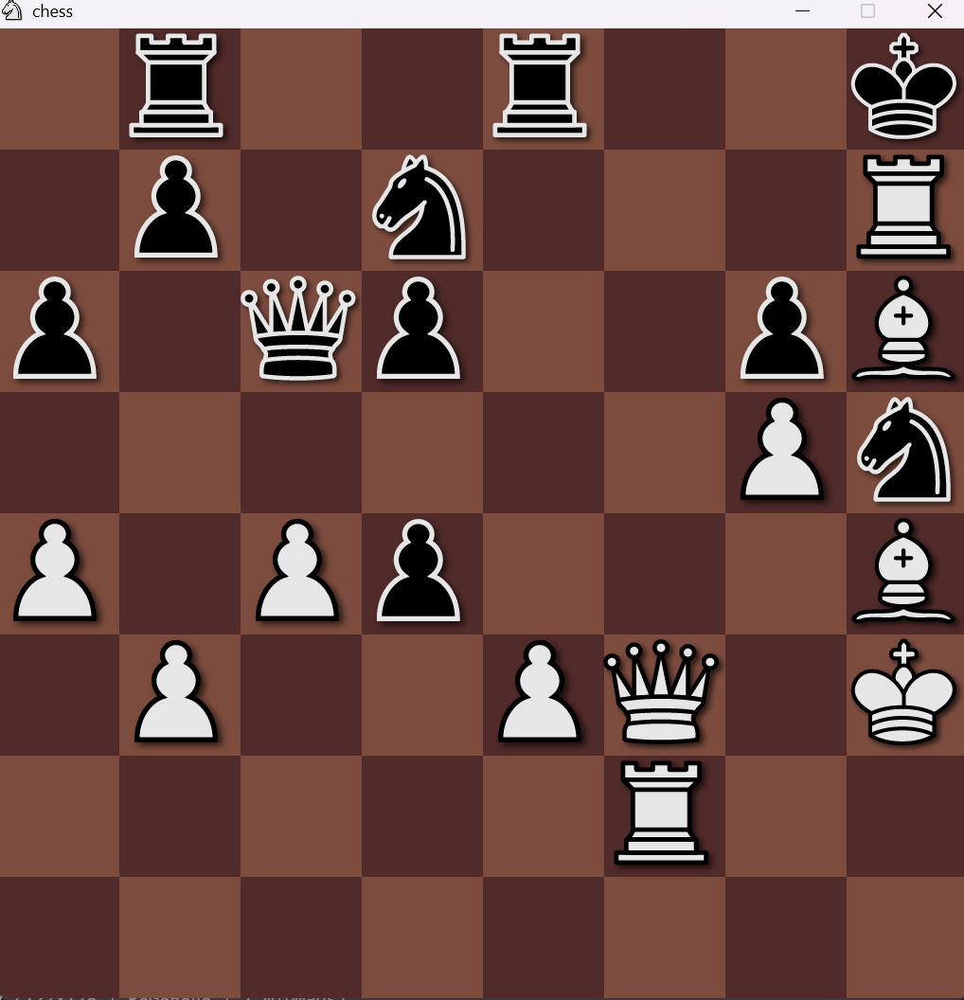

# A Chess Engine(In Progress)

- This is a project to learn how chess engines work(It is not meant to be performant).
- In this project the raylib library is used to do the rendering of the chess board.

# Board Preview


# FEN String
- the program asks the user for a custom FEN string if the player wants to start with a diffrent starting position.
- the default starting FEN string is below.
``` bash
rnbqkbnr/pppppppp/8/8/8/8/PPPPPPPP/RNBQKBNR w KQkq - 0 1
```

# FEN STRING EXAMPLE
- For the following Fen string the program displays the board in the correct position and correct rules
``` bash
rheakaehr/9/1c5c1/p1p1p1p1p/9/9/P1P1P1P1P/1C5C1/9/RHEAKAEHR w 0 1
```


# How to compile
- Since the raylib library is statically linked you can run the following command in your terminal.
- If the following doesn't Work you have to link other libraries that raylib depends on , for that you can try the alternative code.
```bash
gcc assets.c game.c chess.c main.c -o main.exe -lraylib
```
- ALTERNATE
```bash
gcc assets.c game.c chess.c main.c -o main.exe -lraylib -lraylib -lopengl32 -lgdi32 -lwinmm
```